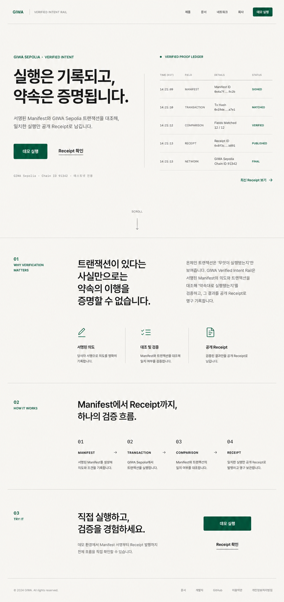

# Main Landing Editorial Proof Redesign

**Date:** 2026-07-29
**Status:** Selected visual direction, pending written-spec review
**Route:** `/`
**Primary conversion:** `/giwa-demo`

## Goal

Turn the root page into a concise, production-usable product landing whose
first job is to move an interested visitor into the live GIWA Sepolia demo.
The page must explain the product enough to make that action feel credible,
without reading like a pitch deck, evaluator checklist, or generic Web3 site.

The selected visual target is:



This image is a visual reference, not a source of factual product data. The
implementation continues to render validated repository evidence and existing
public artifacts.

## Success criteria

1. The first viewport contains the product promise, one dominant
   `데모 실행` action, one quiet `Receipt 확인` action, and a readable proof
   preview.
2. The headline keeps two intentional lines at a 1440 px viewport and never
   collapses into the current five-line block at intermediate desktop widths.
3. The proof preview is fully visible. It never clips past the viewport or
   creates horizontal overflow.
4. The complete page is materially shorter than the current roughly 7,900 px
   document and uses four narrative chapters at most.
5. Sections are separated primarily with spacing, alignment, typography, and
   thin rules rather than repeated cards.
6. Public claims remain testnet-only and evidence-backed.
7. The landing stays useful when JavaScript or the live API is unavailable.

## Product story and copy

### Hero

- Eyebrow: `GIWA SEPOLIA · VERIFIED INTENT`
- Headline:

  > 실행은 기록되고,
  > 약속은 증명됩니다.

- Supporting copy:

  > 서명된 Manifest와 GIWA Sepolia 트랜잭션을 대조해, 일치한 실행만
  > 공개 Receipt로 남깁니다.

- Primary action: `데모 실행` → `/giwa-demo`
- Secondary action: `Receipt 확인` → the validated recorded public Receipt,
  with `/evidence` as the existing fallback
- Boundary note: `GIWA Sepolia · Chain ID 91342 · 테스트넷 전용`

### Chapter 1 — Why verification matters

Heading:

> 트랜잭션이 남았다는 사실만으로는
> 약속의 이행을 증명할 수 없습니다.

Use one short explanation and three unboxed principles:

- `서명된 의도` — 실행 전 조건과 대상을 기록합니다.
- `필드 대조` — network, target, action, amount를 대조합니다.
- `공개 Receipt` — 모두 일치한 실행만 공개합니다.

### Chapter 2 — One verification flow

Heading:

> Manifest에서 Receipt까지,
> 하나의 검증 흐름.

Present one continuous sequence:

1. `Manifest` — 의도와 조건을 서명합니다.
2. `Transaction` — GIWA Sepolia에서 실행합니다.
3. `Field match` — 네 필드의 일치 여부를 확인합니다.
4. `Receipt` — 일치한 결과를 공개합니다.

This is one grouped ledger or timeline, not four independent cards.

### Chapter 3 — GIWA and current scope

Keep this as a compact factual strip rather than a full promotional section:

- now: GIWA Sepolia testnet execution and Standard RPC evidence;
- output: matched-only public Receipt;
- next: GIWA Wallet in-app entry, clearly labeled as future direction.

Do not imply mainnet readiness, settlement, real funds, current GIWA Wallet
availability, security guarantees, or customer adoption.

### Final action

Heading:

> 직접 실행하고,
> 결과를 확인해보세요.

Repeat the primary `데모 실행` action and keep `Receipt 확인` visually
secondary.

## Layout

### Header

- Use a slim, border-bottom header.
- Keep the wordmark on the left.
- Keep only three quiet anchors: `제품`, `검증 방식`, `GIWA`.
- Keep a compact `데모 실행` button on the right.
- Do not expose every existing section as navigation.

### Hero

- Desktop content width: `min(1280px, calc(100% - 96px))`.
- At 1180 px and above, use a balanced two-column composition: copy on the
  left and one integrated proof ledger on the right.
- Below 1180 px, stack the proof ledger beneath the copy before either column
  becomes cramped.
- Use a minimum first-viewport height rather than forcing every viewport into
  a fixed `100vh`.
- The proof ledger uses one surface with internal row rules. It has no shadow
  and no separate nested cards.

### Page rhythm

- Use four chapters at most: hero, why, flow/scope, final action.
- Prefer vertical spacing of 120–168 px on wide screens, 88–112 px on tablets,
  and 64–80 px on mobile.
- Keep long-form copy to roughly 55 Korean characters per line.
- Avoid empty full-screen sections that exist only to create scroll length.

## Visual system

- Primary typeface: `Pretendard Variable`.
- Monospace is limited to hashes, chain identifiers, field names, and short
  machine states.
- Hero headline range:
  - wide desktop: 72–88 px;
  - intermediate desktop/tablet: 52–64 px;
  - mobile: 38–44 px.
- Body copy remains 16–19 px with comfortable line height.
- Base: warm ivory.
- Ink: near-black.
- Accent: one deep GIWA green.
- Muted text and dividers use neutral gray with accessible contrast.
- Controls use a restrained 8–10 px radius.
- No gradients, glass effects, floating shadows, paper slips, stamps, blobs,
  crypto coins, shields, locks, 3D objects, or generic decorative icons.

## Interaction and motion

- Keep the existing native anchor navigation and CTA links.
- Use the existing dependency-free landing script.
- Reveal sections with subtle opacity and vertical movement only.
- The proof sequence may advance a thin progress rule as it enters the
  viewport.
- Do not use scroll-jacking, pinned horizontal scrolling, cursor replacement,
  parallax, autoplay media, or continuous decorative animation.
- Under `prefers-reduced-motion`, reveal all essential content immediately and
  disable nonessential transitions.

## Responsive and accessibility requirements

- Verify widths at 1440, 1180, 1024, 768, 390, and 360 px.
- No horizontal overflow at any verified width.
- Keep semantic landmarks, heading order, the skip link, accessible link
  names, and visible keyboard focus.
- Keep practical pointer targets at least 44 px tall.
- Do not use green alone to express a matched state; pair it with explicit
  `MATCHED`, `VERIFIED`, or equivalent text.
- Hashes and evidence values wrap safely.
- On mobile, the primary CTA becomes full width and the secondary action
  remains a text link.

## Implementation boundary

Change only the root landing sources and their focused tests:

- `apps/web/public/landing.html`
- `apps/web/public/landing.css`
- `apps/web/public/landing.js` only when the approved reveal/progress behavior
  needs adjustment
- `apps/web/src/lib/landing/landingPresentation.test.ts`

Do not change `/giwa-demo`, wallet logic, chain logic, contracts, APIs,
database behavior, evidence generation, Nginx, Lightsail, or public deployment
as part of this redesign.

## Verification

Automated checks:

```text
pnpm --filter @giwa/web test -- landingPresentation
pnpm --filter @giwa/web test
pnpm typecheck
pnpm build
```

Browser checks:

- hero copy and proof ledger are both visible at 1440 px;
- proof ledger stacks without clipping below 1180 px;
- `데모 실행` resolves to `/giwa-demo`;
- recorded Receipt fallback remains valid;
- no console errors or horizontal overflow;
- keyboard order follows visual order;
- reduced-motion behavior remains readable;
- the final rendered page is compared against the selected visual reference at
  matching viewport dimensions.

## Delivery boundary

Approval of this specification authorizes local implementation and local
verification only. It does not authorize Git staging or commit, public
deployment, Lightsail changes, wallet signatures, or chain transactions.
